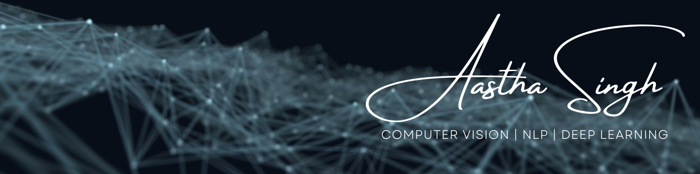

  

  <em>
    A budding <b>Data Scientist</b> on a journey to make exciting contributions in the field of <b>Natural Language Processing, Computer Vision, and Deep Learning.</b>&nbsp; I am a storyteller, born out of adventures, who is <b>passionate.</b>
  </em> 

---

<!-- 

  
  

 -->

<h2 align="center"><b>🙋‍♀️ About me</b></h2>

→ I have done my engineering with majors in Electronics and Communication and minors in Machine Learning from Birla Institute of Technology, Mesra. 

→ My primary focus is on Deep Learning research

→ I am currently working as an AI Research Intern at SparkCognition

→ Previously I worked as a NLP Intern at NVIDIA

→ I regularly write articles on [Medium](https://aastha-eng.medium.com/)

→ I love to travel with a purpose which is educational and adventurous!

---

<h2 align="center"><b> 🤝 Connect with me</b></h2>

  
  
  
  

 ---

 <h2 align="center"><b>🛠 Technologies I am good at </b></h2>

  
  
  
  
  
  
  
  

---

<h2 align="center"><b>🔥 Streaks</b></h2>

<!-- GitHub Readme Streak Stats - https://github.com/DenverCoder1/github-readme-streak-stats -->

  

<h2 align="center"><b>📈 Stats for Nerds</b></h2>

---

<h2 align="center"><b>📝 Blogs</b></h2>

<!-- BLOG-POST-LIST:START -->
- [Speed up the development with advanced pair programming: GitHub Copilot](https://medium.com/analytics-vidhya/speed-up-the-development-with-advanced-pair-programming-github-copilot-68eb6d30a993)
- [Auto-code generation using GPT-2](https://medium.com/geekculture/auto-code-generation-using-gpt-2-4e81cb05430)
- [English to Hindi Neural Machine Translation with NVIDIA NeMo toolkit](https://medium.com/@aastha-eng/english-to-hindi-neural-machine-translation-with-nvidia-nemo-toolkit-df11ed854fa1)
- [Evolving with BERT: Introduction to RoBERTa](https://medium.com/analytics-vidhya/evolving-with-bert-introduction-to-roberta-5174ec0e7c82)
- [Introduction to NumPy](https://medium.com/@aastha-eng/introduction-to-numpy-68e3f0ee7206)
<!-- BLOG-POST-LIST:END -->

➡️ [more blog posts...](https://aastha-eng.medium.com/)

---
